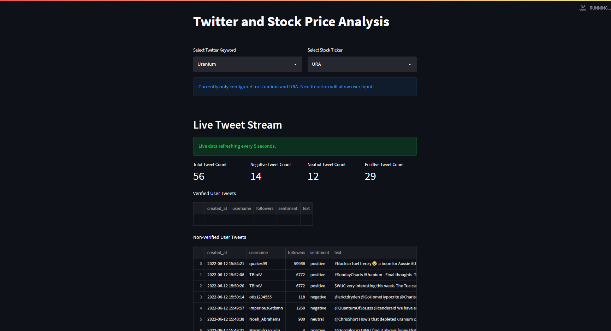
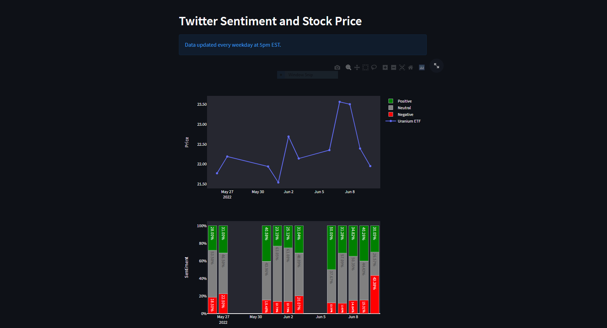
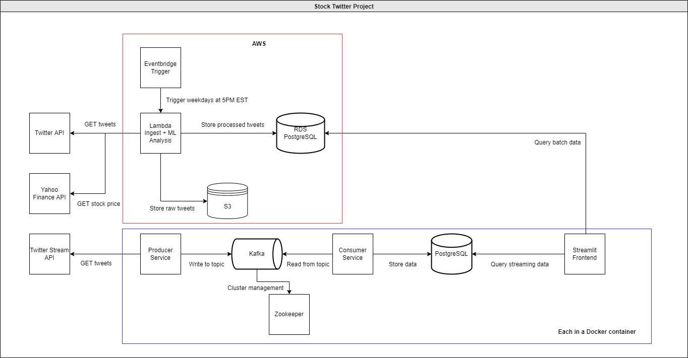

## Stock Twitter Project

#### Description

Tool for users to analyze and explore the relationship between investor sentiment and equity prices. Users can input a desired twitter keyword and stock ticker. As of right now, the app only supports "Uranium" and "URA". Next version will expand options.

The first section shows a real-time stream of tweets.

- Count of tweets streamed
- Verified user tweets
- Non-verified user tweets

The second section shows two timeseries charts.

- stock ticker's chart
- sentiment chart - broken down by negative, neutral, and positive.

#### Technologies used:

EventBridge, Lambda, S3, RDS, Python, PostgreSQL, Kafka, Zookeeper, Streamlit, APIs, Docker.

